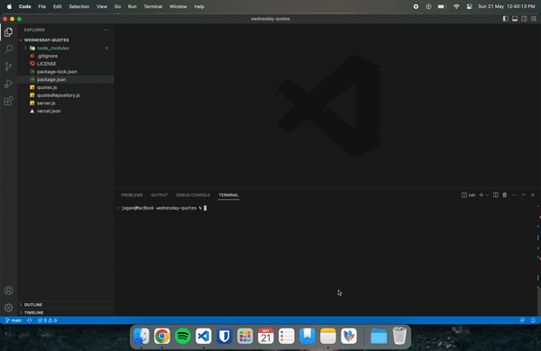

# Wednesday Quotes API

A simple API to retrieve some quotes from Wednesday!

:globe_with_meridians: Website: https://jaganganesh.tumblr.com

## API

### `GET /v1/quotes`

Get a random quote in this format:

> `https://localhost:3001/v1/quotes`

    [
    	{
    		"quote": "Nevermore is like no other boarding school. It's a magical place",
    		"author": "Gomez Addams"
    	}
    ]

### `GET /v1/quotes/{number}`

Returns an array with `{number}` quotes e.g. `GET /v1/quotes/5`.

> `https://localhost:3001/v1/quotes/5`

    [
    	{
    		"quote": "I'm not sure whose twisted idea it was to put hundreds of adolescents in underfunded schools run by people whose dreams were crushed years ago, but I admire the sadism",
    		"author": "Wednesday Addams"
    	},
    	{
    		"quote": "Pugsley, emotion equals weakness",
    		"author": "Wednesday Addams"
    	},
    	{
    		"quote": "Wednesday, what are you gonna go?",
    		"author": "Pugsley Pubert Addams"
    	},
    	{
    		"quote": "Nevermore is like no other boarding school. It's a magical place",
    		"author": "Gomez Addams"
    	},
    	{
    		"quote": "Wednesday always looks half dead.",
    		"author": "Gomez Addams"
    	},
    ]

## Contributing

If you want to add some quotes, add them in the `quotes.js` file and do a pull request!

## Credits

Inspired by [Ron Swanson Quotes](https://github.com/jamesseanwright/ron-swanson-quotes).
